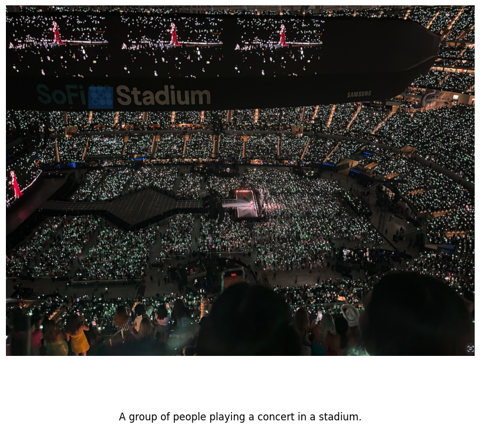

# GPT-2 Vision

Learn how to build a vision-language model 

GPT-2 Vision is a language model that has been augmented with CLIP to understand images. Given an image, it is able to generate text describing that image. The model is written from scratch in under 1000 lines of pure PyTorch


|  |  |      |
|-------------------------------|--------------------------------|--------------------------------|
|    |     |  |
|     |   |      |

*Captions generated by GPT-2 Vision on unseen images*

## Overview

GPT-2 Vision works by feeding an image into CLIP, which generates visual embeddings that represent the meaning of the image in a language space. A multi-layer perceptron aligns these visual embeddings with GPT-2's specific language embedding space. GPT-2 uses these refined embeddings to produce a text description of the image

CLIP and GPT-2 are initialized with OpenAI's pre-trained model weights. The multi-layer perceptron is trained from randomly initialized parameters using image-text pairs from the [COCO dataset](https://cocodataset.org/#home)

## Background

### Language models

Given a sequence of words (a prompt), language models predict the next likely word

For example:

A cat sat on a red ___.

A language model will likely predict "mat" instead of "lava" because the data it was trained on likely contains many examples of cats sitting on mats but few of cats sitting on lava

###  Word embeddings

To make these predictions, language models like GPT-2 first convert the prompt into word embeddings. These embeddings can be thought of as points in a high-dimensional space where similar words are near one another

Regions in this space represent semantic meaning -- word embeddings for animals might reside in a particular space, whereas embeddings for sporting equipment might reside in another

### Predicting the next word using embeddings

To predict the next word, the model could naively find an embedding closest to all the prompt word embeddings. For example, given the sentence "The sun rises every ___," it might easily select "morning" because "sun rises" is unambiguously associated with "morning."

However, this approach could fail for words with multiple meanings like "bat." 

Consider the following sentences:

1. The bat flew out of the ___.
2. The player swung the bat at the ___.
 
Would the embedding space near "bat" represent the animal or sports equipment?

### Context-aware predictions

To solve this, language models use the full context of the prompt to refine the embeddings, transforming them in a way that captures the complete meaning of the text. The next word is then sampled from a region in the space close to this context-aware representation

In the first sentence, a language model might focus on "flew out," adjusting the embeddings to create a representation meaning "bat" as a flying animal. This refined embedding might be close to "cave" in the semantic space, so the model may predict "cave."

In the second sentence, a model might focus on "player swung," adjusting the embeddings to represent "bat" as sports equipment, leading the model to predict "baseball."

In sum, **language models transform word embeddings in a way that captures the full meaning of the text, making it easier to accurately find the next word.**

<div align="center">
 
</div>

*A GPT-2 language model converting a sequence of text into word embeddings, then using these embeddings together to predict the next word*

### Vision language models

<div align="center">
 
</div>

## Install

```shell
$ python -m venv venv
$ source venv/bin/activate
$ pip install -r requirements.txt
```

## Train

Download the GPT-2 and CLIP pre-trained model weights

The training code updates a multi-layer perceptron to align visual embeddings from CLIP with word embeddings from GPT-2

Train using an NVIDIA GPU with at least 6GB of VRAM

```shell
$ python train.py
```

## Run

Generate captions on your own images
```shell
$ python generate.py
```
