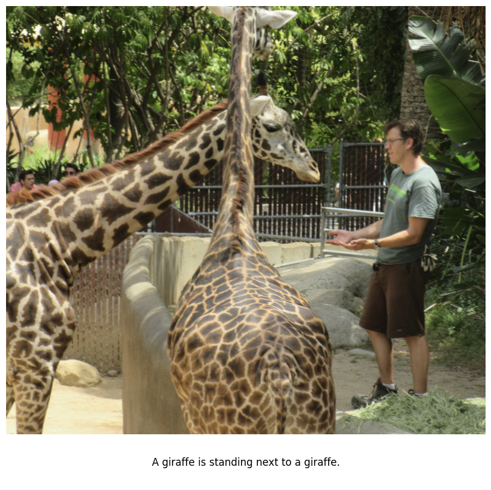

# GPT-2 Vision

Learn how to build a vision-language model 

GPT-2 Vision is a language model that has been augmented with CLIP to understand images. Given an image, it is able to generate text describing that image

The model is an experiment in reproducing the training techniques rumored to be behind state-of-the-art multimodal models like GPT-4 Vision, but using much smaller models: GPT-2 small (124M) and CLIP ViT-B/32

The code is designed to be educational and is written from scratch in just 5 files, totaling under 1000 lines of pure PyTorch

<div align="center">
 
 <br>
 <em>Caption generated by GPT-2 Vision on an unseen image of me</em>
 <br>
 <em>See more sample model outputs <a href="#Samples">here</a></em>
</div>

## Overview

GPT-2 Vision works by feeding an image into CLIP, which generates visual embeddings that represent the meaning of the image in a language space. A multi-layer perceptron aligns these visual embeddings with GPT-2's specific language embedding space. GPT-2 uses these refined vision-language embeddings to produce a text description of the image

CLIP and GPT-2 are initialized with OpenAI's pre-trained model weights. The multi-layer perceptron is trained from randomly initialized weights using image-text pairs from the [COCO dataset](https://cocodataset.org/#home)

## Background

### Language models

Given a sequence of words (a prompt), language models like GPT-2 predict the next likely word

For example:

A cat sat on a red ___.

A language model will likely predict "mat" instead of "lava" because the data it was trained on likely contains many examples of cats sitting on mats but few of cats sitting on lava

<div align="center">
 
</div>

*A language model converts a sequence of text into word embeddings, then uses these embeddings together to predict the next word*

###  Text embeddings

To make these predictions, language models first convert the prompt into word or "text" embeddings. These embeddings can be thought of as points in a high-dimensional space where similar words are near one another

Regions in this space represent semantic meaning -- word embeddings for animals might reside in a particular space, whereas embeddings for sporting equipment might reside in another

### Predicting the next word using embeddings

To predict the next word, a model could naively find an embedding closest to the embeddings of all the words in the prompt

For example, given the sentence "The sun rises every ___," the model might easily select "morning" because "sun" and "rises" are unambiguously associated with "morning" and would likely reside in a similar space

However, this approach could fail for words with multiple meanings like "bat" 

Consider the following sentences:

1. The bat flew out of the ___.
2. The player swung the bat at the ___.
 
Would the embedding space near "bat" represent the animal or baseball equipment?

### Context-aware predictions

To address this ambiguity, language models use the full context of the prompt to effectively combine the embeddings, capturing the complete meaning of the text. The next word is then sampled from a region in the space close to this context-aware representation

In the first sentence, a language model might focus on "flew out," adjusting the embeddings to create a representation meaning "bat" as a flying animal. This refined animal embedding might be close to "cave" in the semantic space, so the model may predict "cave"

In the second sentence, a model might focus on "player swung," adjusting the embeddings to represent "bat" as sports equipment, leading the model to predict "baseball"

In sum, **language models transform word embeddings in a way that captures the full meaning of the text, making it easier to accurately find the next relevant word**

### Visual embeddings with CLIP

Just as text embeddings represent language, visual embeddings represent images

CLIP is a model that produces both visual and text embeddings in a shared high-dimensional semantic space

When trained, CLIP places visual embeddings, such as those from an image of a bat, close to the appropriate text embeddings in that semantic space

### Vision-Language Models

A vision-language model consumes both image and text inputs and generates text

[GPT-2](gpt.py), a pure-text language model, can be converted into a vision-language model by enabling it to accept visual inputs from [CLIP](clip.py)

GPT-2 cannot natively generate text using CLIP visual embeddings because GPT-2 and CLIP operate in their own unique embedding spaces. However, by moving CLIP's visual representations, such as images of bats, close to GPT-2's text representations of bats, GPT-2 can generate relevant text about the bat images as if it were using its own standard bat text embeddings

Transforming the CLIP embeddings over to the GPT-2 text space is achieved through a multi-layer perceptron (MLP) called a [vision-language connector](vision_language_connector.py). The MLP acts as a mathematical function that shifts points from one location (the CLIP space) to another (the GPT-2 space)

**When these transformed visual embeddings are input into GPT-2, it can reason about the full meaning of the image to generate relevant text, converting it into a vision-language model**

<div align="center">
 
</div>

*CLIP converts an image into a set of visual embeddings, which an MLP transforms into GPT-2's language embedding space. GPT-2 uses these embeddings, along with any initial text, as context to generate text relevant to the image*

## Samples

|    |    |
|---------------------------------|-----------------------------------|
|      |        |
|       |        |
|       |     |

*Captions generated by GPT-2 Vision on unseen images*

## Install

```shell
$ python -m venv venv
$ source venv/bin/activate
$ pip install -r requirements.txt
```

## Train

Download the pre-trained GPT-2 and CLIP model weights from Hugging Face [here](https://huggingface.co/dxdtran/gpt2-vision/tree/main)

The training code updates a multi-layer perceptron to align visual embeddings from CLIP with text embeddings from GPT-2

Train using an NVIDIA GPU with at least 6GB of VRAM

Training takes approximately 2 hours per epoch on the COCO training set using an RTX 4090

```shell
$ python train.py
```

## Run

Generate captions on your own images

Download the pre-trained vision-language connector model weights from Hugging Face [here](https://huggingface.co/dxdtran/gpt2-vision/tree/main)

Create a folder named `input_images` and place images you want the model to caption inside this folder

The images with their generated captions will be saved to a folder named `outputs`

```shell
$ python generate.py
```
